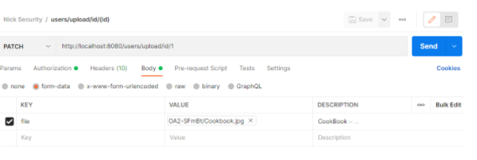

# Back-end instructies F.C.

Dit bestand bevat instructies voor het werken met Springboot Security en de REST Endpoints. Lees de instructies stap voor stap, zo weet je zeker dat alles goed ingesteld staat. Zorg ervoor dat je de gehele installatiehandleiding hebt gelezen voordat je begint met werken met de Back-end instructies van dit bestand.

We gaan ook een kijk te nemen naar welke gebruikers en gebruikersrollen aanwezig zijn in de applicatie, deze zijn opgenomen in hoofdstuk 'Gebruikers en gebruiksrollen'. 
Het is belangrijk om te begrijpen welke functies mogelijk zijn bij elke gebruikersrol. Deze functies worden beschreven in het hoofdstuk 'REST Endpoints'.

Tot slot worden met het programma Postman API requests gedaan met behulp van de JSON-voorbeelden uit het hoofdstuk 'JSON-voorbeelden'. Om dit te kunnen doen is het van belang om het project uit IntelliJ gestart te hebben (d.m.v. de button ‘Run’), ook moet de gekoppelde server in PostgreSQL online zijn.

**Link naar de Github Repository:** https://github.com/Roy812/fitness-classes_react-v1

## Inhoud
 * [Voorbereiding database](#voorbereiding)
 * [Gebruikers en rollen](#Gebruikers-en-rollen)
 * [REST Endpoints](#Rest-endpoints)
 * [JSON-voorbeelden](#JSON-voorbeelden)
    * [AuthController](#AuthController)
    * [UserController](#UserController)
    * [ReviewController](#ReviewController)
    * [AgendaController](#AgendaController)
    * [LessonController](#LessonController)
    * [ExceptionController](#ExceptionController)

    
## Voorbereiding database
Open in het project de map resources -- > application.properties. Zie onderstaand voorbeeld:


Vul op regel 4 achteraan de URL de naam toe van de database in PostgreSQL die is aangemaakt.
**NB: PostgreSQL maakt altijd een standaard database aan genaamd postgres.**

Vul het wachtwoord uit de **_"Installatiehandleiding stap 6 – Intallatie (PostgreSQL)"_** in bij spring.datasource.password.

De database is nu gekoppeld en de applicatie is nu klaar voor gebruik.
* Start de applicatie: `mvnw spring-boot:run`

**Create vs. Update**

De database van PostgreSQL staat in dit project op ‘update’. Dit heeft als functie om ten alle tijden niks te verwijderen wat in de database opgeslagen staat. Daartegenover heeft de optie ‘create’ het effect dat telkens als de het project in IntelliJ opnieuw wordt gestart de database volledig leeggehaald wordt. 

De testdata die aanwezig is in dit project staat opgeslagen in de database. Deze data zal niet verwijderd worden bij het opstarten van het programma omdat de functionaliteit zoals hierboven omschreven staat op ‘update’. Indien het gewenst is om de data te verwijderen, zet deze functie op ‘create’ door de volgende stappen te volgen:

**Stap 1:**
Open de map ‘src’ -- > ‘main -- > ‘resources’ -- > ‘application.properties’.

**Stap 2:**
Pas de regel ‘spring.jpa.hibernate.ddl-auto=update’ aan zodat de expressie eindigt met ‘create’.


## Gebruikers en rollen
Dit project maakt gebruik van drie user-rollen. `user`, `mod` & `admin`. Elke gebruiker kan 0 tot meerdere rollen 
hebben. Het is belangrijk om je te realiseren dat wanneer een gebruiker de `admin`-rol heeft dat deze dan niet
automatisch de `user` en `mod`-rollen heeft. 

De inloggegevens voor de gebruikers in de testdata zijn te vinden in de **_"Installatiehandleiding -
hoofdstuk 5"_**.


## Rest endpoints
In dit hoofdstuk worden alle end-points beschreven met JSON-voorbeelden om een API request op te kunnen stellen in Postman. De applicatie draait op localhost en werkt met http requests, het eerste deel van de request is daardoor altijd hetzelfde: https://localhost8080. Het tweede deel van de request bestaat uit de mapping, deze is aangegeven in de onderstaande voorbeelden.
Bij het maken van API requests is het noodzakelijk dat in de header een geldige jwt token toegevoegd is. Tevens moet de juiste gebruiker ingelogd zijn om de juiste requests te kunnen maken.

### **Authenticatie**

De gebruiker dient als eerste request altijd een /api/auth/signin end-point te gebruiken om zo authenticatie te krijgen tot zijn toegewezen functies. 
Het gebruiken van dit endpoint is omschreven in het eerste onderstaande JSON-voorbeeld.

### **Type request**

Het type request is belangrijk omdat de functies hiertussen verschillen van elkaar. 
Zie onderstaande overzicht.

* **GET:** Betreft het ophalen van data.
* **POST:** Betreft het creëren van een nieuwe instantie van een klasse/entity
* **PATCH:** Betreft het maken van een aanpassing in een instantie van een klasse/entity.
* **PUT:** Betreft het maken van een aanpassing in een instantie van een klasse/entity. Een belangrijk verschil met de PATCH-mapping is dat bij PUT-mapping een nieuwe instantie wordt aangemaakt in de database.
* **DELETE:** Betreft het verwijderen van een instantie van een klasse/entity.

## JSON-voorbeelden
Voordat we API requests kunnen gaan verzenden met Postman zijn een aantal zaken van belang. We hebben als eerste de complete mapping nodig van de functie die we willen gebruiken. 
Vervolgens dienen we het juiste type request te selecteren zodat Postman niet een GET request gaat doen, terwijl we bijvoorbeeld een gebruiker willen registreren. 

In de 'Body' voegen we ons JSON-object toe aan ons request, en in de 'Authorization' bepalen de manier waarop we toegang krijgen tot de informatie die we willen ontvangen/sturen. 
Wanneer we ons API request volledig hebben ingevuld kunnen we klikken op de blauwe button 'Send' om het request te verzenden. Zie onderstaand voorbeeld:


###AuthController
* http://localhost:8080/api/auth/signup (POST-request):
  Met deze functie kan een nieuwe gebruiker geregistreerd worden, daarbij wordt ook een gebruikersrol gekozen. 
  Het is mogelijk om meerdere gebruikersrollen toe te schrijven indien gewenst.
* http://localhost:8080/api/auth/signin (POST-request):
  Met deze functie kan een gebruiker inloggen met zijn username en wachtwoord. 
  Wanneer de gebruiker ingelogd is heeft hij toegang tot de functies die behoren tot zijn rol.

###Uitwerking JSON
**/api/auth/signup**
1. Selecteer binnen 'Authorization'-->'No Auth'.
2. Voeg het JSON-object toe aan de 'Body':

```json
{
    "username": "user@user.com",
    "email" : "test@user.com",
    "password" : "123456",
    "role": ["user"],
    "coinBalance": 1,
    "subscribeToNewsletter": true
}
```
**Toelichting**
De waarde bij 'username' mag niet al bij een andere gebruiker aanwezig zijn in de database. 
De "coinBalance" en "subscribeToNewsletter" kunnen op voorhand een waarde meekrijgen, dit is niet verplicht. 
Tot slot is mogelijk om meerdere rollen toe te schrijven aan één gebruiker, dit zou als volgt genoteerd worden binnen het JSON-object:

```json
{
  "username": "user@user.com",
  "email" : "test@user.com",
  "password" : "123456",
  "role": ["user", "mod", "admin"],
  "coinBalance": 1,
  "subscribeToNewsletter": true
}
```

**/api/auth/signin**
1. Selecteer binnen 'Authorization'-->'No Auth'.
2. Voeg het JSON-object toe aan de 'Body':

```json
{
  "username": "plaats hier de 'username' van de gebruiker",
  "password": "plaats hier de 'password' van de gebruiker"
}
```

3. Klik op de blauwe button 'Send'.

**Toelichting**

Inloggen gebeurt altijd met 'username' en 'password' van de gebruiker. Wanneer de gebruiker ingelogd is heeft hij beschikking tot de functies binnen zijn rol. 
Bij het inloggen geeft Postman een 'AccessToken' terug. Zie het onderstaande voorbeeld:


Met deze Accesstoken(AT) kan gebruik gemaakt worden van de functies die gebruiker bezit. 
Vul in het gepaste API request de AT in onder 'Authorization' --> 'Bearer Token'. Zie het onderstaande voorbeeld:


Klik nu op de blauwe button 'Send' om het API request te verzenden.

###UserController
* http://localhost:8080/users/newsletter/id/{id} (PATCH-request): Met deze functie kan de gebruiker met de rol 'USER' zich aanmelden of afmelden voor de nieuwsbrief.
*NB: De 'userId' die gebruikt wordt om mee te zoeken moet ingevuld worden op de plaats van '{id}'.
* http://localhost:8080/users/password/id/{id} (PATCH-request) De gebruiker met de rol 'USER' kan met behulp van deze functie zijn wachtwoord aanpassen. 
  Het wachtwoord zal aangepast worden in de instantie van de gebruiker in de database entity/klasse.
  *NB: De 'userId' die gebruikt wordt om mee te zoeken moet ingevuld worden op de plaats van '{id}'.
* http://localhost:8080/users/upload/id/{id} (PATCH-request) Met de functie kan de gebruiker met de rol 'USER' een profielfoto uploaden bij zijn profiel van F.C.
  *NB: De 'userId' die gebruikt wordt om mee te zoeken moet ingevuld worden op de plaats van '{id}'.
* http://localhost:8080/users/delete/{id} (DELETE-request) Een gebruiker met de rol ‘USER’ kan met deze functie zijn account verwijderen.
  *NB: De 'userId' die gebruikt wordt om mee te zoeken moet ingevuld worden op de plaats van '{id}'.
* http://localhost:8080/users/subtract/coins/id/{id} (PATCH-request) Een gebruiker met de rol ‘USER’ kan met deze functie coins inleveren. 
  De functie checkt of de gebruiker een ‘coinBalance’ heeft die hoger is dan 0.  
  *NB: De 'userId' die gebruikt wordt om mee te zoeken moet ingevuld worden op de plaats van '{id}'.
* http://localhost:8080/users/balance/id/{id} (PATCH-request) Een gebruiker met de rol ‘ADMIN’ kan met deze functie Coins toe voegen aan het account van een ‘USER’.
  *NB: De 'userId' die gebruikt wordt om mee te zoeken moet ingevuld worden op de plaats van '{id}'.
* http://localhost:8080/username/{username} (GET-request) Met deze methode kan de gebruiker met de rol ‘ADMIN’ een gebruiker opzoeken door middel van de 'username'.
  *NB: De 'username' die gebruikt wordt om mee te zoeken moet ingevuld worden op de plaats van '{username}'.
* http://localhost:8080/users/password/{password} (GET-request) Met deze methode kan de gebruiker met de rol ‘ADMIN’ een gebruiker opzoeken door middel van het 'password'.
  *NB: De 'password' die gebruikt wordt om mee te zoeken moet ingevuld worden op de plaats van '{password}'.
* http://localhost:8080/users/id/{id} (GET-request) Met deze methode kan de gebruiker met de rol ‘ADMIN’ of ‘USER’ een gebruiker opzoeken door middel van de 'userId'.
  *NB: De 'userId' dat gebruikt wordt om mee te zoeken moet ingevuld worden op de plaats van '{id}'.
* http://localhost:8080/users/picture/id/{id} (GET-request) Met deze methode kan de gebruiker met de rol 'USER' zijn 'profilePicture' ophalen.  
  *NB: De 'userId' dat gebruikt wordt om mee te zoeken moet ingevuld worden op de plaats van '{id}'.

###Uitwerkingen JSON
**/users/newsletter/id/{id}**
1. Log een gebruiker in met de rol "user" via /api/auth/signin.
2. Plaats de juiste mapping inclusief de gewenste 'userId'.
3. Selecteer het juiste type request.
4. Plaats te AccessToken (AT) in de opties 'Authorization'-->'Bearer Token'.
5. Klik op de blauwe button 'Send'.

**/users/password/id/{id}**
1. Log een gebruiker in met de rol "user" via /api/auth/signin.
2. Plaats de juiste mapping inclusief de gewenste 'userId'.
3. Selecteer het juiste type request.
4. Plaats te AccessToken (AT) in de opties 'Authorization'-->'Bearer Token'.
5. Klik op de blauwe button 'Send'.

**/users/upload/id/{id}**
1. Log een gebruiker in met de rol "user" via /api/auth/signin.
2. Plaats de juiste mapping inclusief de gewenste 'userId'.
3. Selecteer het juiste type request.
4. Plaats te AccessToken (AT) in de opties 'Authorization'-->'Bearer Token'.
5. Selecteer in de 'Body'-->'form-data' een bestand om te verzenden, belangrijk is om ook de naam 'file' in te vullen. Zie onderstaand voorbeeld:


6. Klik op de blauwe button 'Send'.

**/users/delete/{id}**
1. Log een gebruiker in met de rol "user" via /api/auth/signin.
2. Plaats de juiste mapping inclusief de gewenste 'userId'.
3. Selecteer het juiste type request.
4. Plaats te AccessToken (AT) in de opties 'Authorization'-->'Bearer Token'.
5. Klik op de blauwe button 'Send'.

**/users/subtract/coins/id/{id}**
1. Log een gebruiker in met de rol "user" via /api/auth/signin.
2. Plaats de juiste mapping inclusief de gewenste 'userId'.
3. Selecteer het juiste type request.
4. Plaats te AccessToken (AT) in de opties 'Authorization'-->'Bearer Token'.
5. Klik op de blauwe button 'Send'.

**/users/balance/id/{id}**
1. Log een gebruiker in met de rol "admin" via /api/auth/signin.
2. Plaats de juiste mapping inclusief de gewenste 'userId'.
3. Selecteer het juiste type request.
4. Plaats te AccessToken (AT) in de opties 'Authorization'-->'Bearer Token'.
5. Plaats in de 'Body'-->'raw'-->'JSON' het aantal coins dat toegevoegd moet worden aan de 'coinBalance' van de gebruiker. Zie onderstaand voorbeeld:


**/username/{username}**
1. Log een gebruiker in met de rol "admin" via /api/auth/signin.
2. Plaats de juiste mapping inclusief de gewenste 'username'.
3. Selecteer het juiste type request.
4. Plaats te AccessToken (AT) in de opties 'Authorization'-->'Bearer Token'.
5. Klik op de blauwe button 'Send'.

**/users/password/{password}**
1. Log een gebruiker in met de rol "admin" via /api/auth/signin.
2. Plaats de juiste mapping inclusief de gewenste 'password'.
3. Selecteer het juiste type request.
4. Plaats te AccessToken (AT) in de opties 'Authorization'-->'Bearer Token'.
5. Klik op de blauwe button 'Send'.

**/users/id/{id}**
1. Log een gebruiker in met de rol "user" of "admin" via /api/auth/signin.
2. Plaats de juiste mapping inclusief de gewenste 'userId'.
3. Selecteer het juiste type request.
4. Plaats te AccessToken (AT) in de opties 'Authorization'-->'Bearer Token'.
5. Klik op de blauwe button 'Send'.

**/users/picture/id/{id}**
1. Log een gebruiker in met de rol "user" via /api/auth/signin.
2. Plaats de juiste mapping inclusief de gewenste 'userId'.
3. Selecteer het juiste type request.
4. Plaats te AccessToken (AT) in de opties 'Authorization'-->'Bearer Token'.
5. Klik op de blauwe button 'Send'.

###ReviewController
* http://localhost:8080/users/review/add/id/{id} (POST-request) Met deze functie kan een gebruiker met de rol 'USER' een 'Review' aanmaken.
  *NB: De 'userId' die gebruikt wordt om mee te zoeken moet ingevuld worden op de plaats van '{id}'.
* http://localhost:8080/users/review/findby/title/{title} (GET-request) Met de functie kan een gebruiker met de rol 'USER' reviews vinden op basis van een 'title'.
  *NB: De 'title' die gebruikt wordt om mee te zoeken moet ingevuld worden op de plaats van '{title}'.
* http://localhost:8080/users/review/reply/id/{id} (PATCH-request) Met deze methode kan de gebruiker met de rol ‘MODERATOR’ kan een 'teacherReply' toevoegen aan een 'Review' in de database.
  *NB: De 'reviewId' die gebruikt wordt om mee te zoeken moet ingevuld worden op de plaats van '{id}'.
* http://localhost:8080/users/review/delete/id/{id} (DELETE-request) Met deze methode kan de gebruiker met de rol ‘ADMIN’ een 'Review' verwijderen in de database.
  *NB: De 'reviewId' die gebruikt wordt om mee te zoeken moet ingevuld worden op de plaats van '{id}'.
  
###Uitwerkingen JSON
**/users/review/add/id/{id}**
1. Log een gebruiker in met de rol "user" via /api/auth/signin.
2. Plaats de juiste mapping inclusief de gewenste 'userId'.
3. Selecteer het juiste type request.
4. Plaats te AccessToken (AT) in de opties 'Authorization'-->'Bearer Token'.
5. Plaats in de 'Body'-->'raw'-->'JSON' het volgende JSON-object:

```json 
{
    "title": "plaats hier de 'title' van het object",
    "review": "plaats hier de 'review' van het object",
    "rating": "plaats hier de 'rating' van het object"
}
```
NB: De waarde van ‘title’ moet altijd ingevuld worden. De attributen "review" en "rating" mogen weggelaten worden indien gewenst.
6. Klik op de blauwe button 'Send'.

**/users/review/findby/title/{title}**
1. Log een gebruiker in met de rol "user" via /api/auth/signin.
2. Plaats de juiste mapping inclusief 'title''.
3. Selecteer het juiste type request.
4. Plaats te AccessToken (AT) in de opties 'Authorization'-->'Bearer Token'.
5. Plaats in de 'Body'-->'raw'-->'Text' de 'title' waarop gezocht moet worden.
6. Klik op de blauwe button 'Send'.

**/users/review/reply/id/{id}**
1. Log een gebruiker in met de rol "mod" via /api/auth/signin.
2. Plaats de juiste mapping inclusief de gewenste 'reviewId'.
3. Selecteer het juiste type request.
4. Plaats te AccessToken (AT) in de opties 'Authorization'-->'Bearer Token'.
5. Klik op de blauwe button 'Send'.

**/users/review/delete/id/{id}**
1. Log een gebruiker in met de rol "admin" via /api/auth/signin.
2. Plaats de juiste mapping inclusief de gewenste 'reviewId'.
3. Selecteer het juiste type request.
4. Plaats te AccessToken (AT) in de opties 'Authorization'-->'Bearer Token'.
5. Klik op de blauwe button 'Send'.

###AgendaController
* http://localhost:8080/agenda/add (POST-request) De gebruiker met de rol 'USER' kan met deze functie een Agenda aanmaken in de database.
*  http://localhost:8080/agenda/delete/id/{id} (DELETE) Met deze functie kan een Agenda verwijderd worden. Alleen een gebruiker met de rol 'ADMIN' heeft toegang hiervoor.
  *NB: De 'agendaId' die gebruikt wordt om mee te zoeken moet ingevuld worden op de plaats van '{id}'.
*  http://localhost:8080/agenda/find/all (GET-request) De gebruiker met de rol ‘USER’ kan met deze functie alle boekingen opvragen.
  
###Uitwerkingen JSON
**/agenda/add**
1. Log een gebruiker in met de rol "user" via /api/auth/signin.
2. Plaats de juiste mapping.
3. Selecteer het juiste type request.
4. Plaats te AccessToken (AT) in de opties 'Authorization'-->'Bearer Token'.
5. Plaats in de 'Body'-->'raw'-->'JSON' de gewenste 'userId' en 'lessonId' om deze te koppelen tot een 'Agenda'. Zie onderstaand voorbeeld:


```json 
{
    "title": "plaats hier de 'title' van de booking",
    "userId": 1,
    "lessonId": 1
}
```

6. Klik op de blauwe button 'Send'.

**/agenda/delete/id/{id}**
1. Log een gebruiker in met de rol "admin" via /api/auth/signin.
2. Plaats de juiste mapping inclusief de gewenste 'agendaId'.
3. Selecteer het juiste type request.
4. Plaats te AccessToken (AT) in de opties 'Authorization'-->'Bearer Token'.
5. Klik op de blauwe button 'Send'.

**/agenda/find/all**
1. Log een gebruiker in met de rol "user" via /api/auth/signin.
2. Plaats de juiste mapping.
3. Selecteer het juiste type request.
4. Plaats te AccessToken (AT) in de opties 'Authorization'-->'Bearer Token'.
5. Klik op de blauwe button 'Send'.

###LessonController
* http://localhost:8080/lesson/download/video/id/{id} (GET-request) De gebruiker met de rol 'USER' kan met deze methode de 'classVideo' downloaden.
* http://localhost:8080/lesson/download/guide/id/{id} (GET-request) De gebruiker met de rol 'USER' kan met deze methode de 'lessonGuide' downloaden.
* http://localhost:8080/lesson/add (POST-request) De gebruiker met de rol 'ADMIN' kan met deze functie een 'Lesson' aanmaken in de database.
* http://localhost:8080/lesson/upload/video/id/{id} (PATCH-request) De gebruiker met de rol 'ADMIN' kan met deze functie een 'classVideo' uploaden naar de database.
* http://localhost:8080/lesson/upload/guide/id/{id} (PATCH-request) De gebruiker met de rol 'ADMIN' kan met deze functie een 'lessonGuide' uploaden naar de database.

###Uitwerkingen JSON
**/lesson/download/video/id/{id}**
1. Log een gebruiker in met de rol "user" via /api/auth/signin.
2. Plaats de juiste mapping inclusief de gewenste 'lessonId'.
3. Selecteer het juiste type request.
4. Plaats te AccessToken (AT) in de opties 'Authorization'-->'Bearer Token'.
5. Klik op de blauwe button 'Send'.

**/lesson/download/guide/id/{id}**
1. Log een gebruiker in met de rol "user" via /api/auth/signin.
2. Plaats de juiste mapping inclusief de gewenste 'lessonId'.
3. Selecteer het juiste type request.
4. Plaats te AccessToken (AT) in de opties 'Authorization'-->'Bearer Token'.
5. Klik op de blauwe button 'Send'.

**/lesson/add**
1. Log een gebruiker in met de rol "admin" via /api/auth/signin.
2. Plaats de juiste mapping.
3. Selecteer het juiste type request.
4. Plaats te AccessToken (AT) in de opties 'Authorization'-->'Bearer Token'.
5. Plaats in de 'Body'-->'raw'-->'JSON' het JSON-object. Zie onderstaand voorbeeld:


```json
{
    "title": "plaats hier de 'title' van het object"
}
```
6. Klik op de blauwe button 'Send'.

**/lesson/upload/video/id/{id}**
1. Log een gebruiker in met de rol "admin" via /api/auth/signin.
2. Plaats de juiste mapping inclusief de gewenste 'lessonId'.
3. Selecteer het juiste type request.
4. Plaats te AccessToken (AT) in de opties 'Authorization'-->'Bearer Token'.
5. Selecteer in de 'Body'-->'form-data' een bestand om te verzenden, belangrijk is om ook de naam 'file' in te vullen. Zie onderstaand voorbeeld:



6. Klik op de blauwe button 'Send'.

**/lesson/upload/guide/id/{id}**
1. Log een gebruiker in met de rol "admin" via /api/auth/signin.
2. Plaats de juiste mapping inclusief de gewenste 'lessonId'.
3. Selecteer het juiste type request.
4. Plaats te AccessToken (AT) in de opties 'Authorization'-->'Bearer Token'.
5. Selecteer in de 'Body'-->'form-data' een bestand om te verzenden, belangrijk is om ook de naam 'file' in te vullen. Zie onderstaand voorbeeld:


6. Klik op de blauwe button 'Send'.

###ExceptionController
Deze controller wordt niet gebruikt door middel van een API request.
De service laag gebruikt de ExceptionController om foutmeldingen te kunnen geven wanneer een API request faalt.
